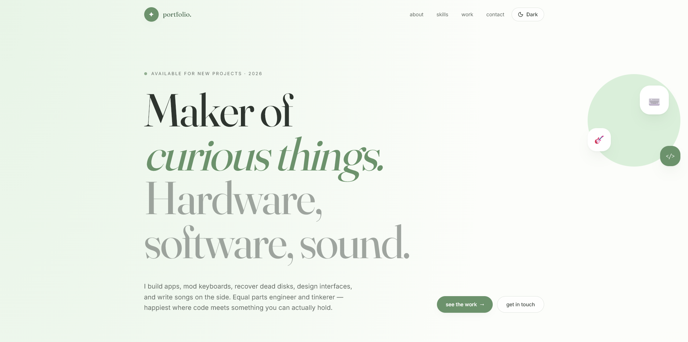
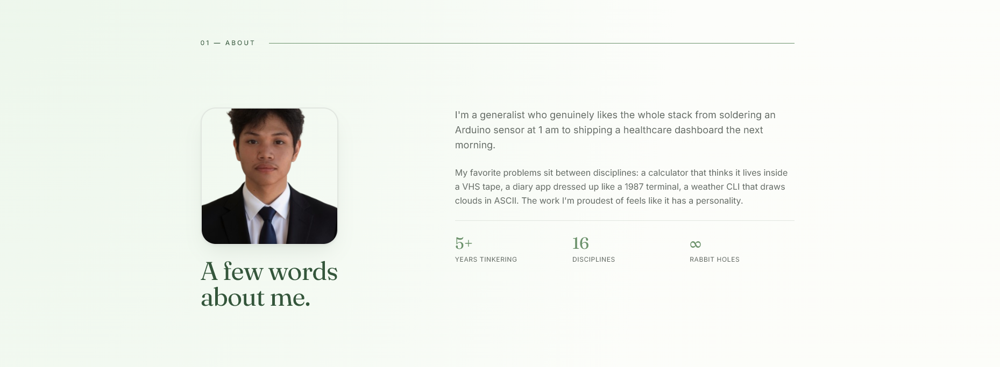
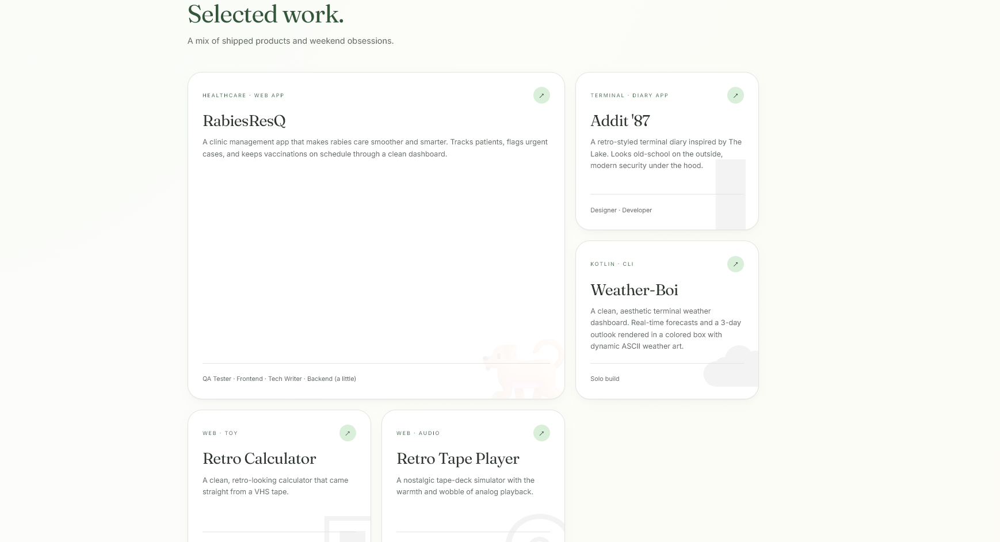

# Portfolio

A personal portfolio website showcasing software, hardware, and creative projects — from clinic management systems to retro terminal apps.

## Technologies Used

- **React 19.2.0** - UI library
- **TypeScript 5.8.3** - Type-safe JavaScript
- **Vite 8.0.16** - Build tool and dev server
- **TanStack Router 1.168.25** - Type-safe routing
- **TanStack Start 1.167.50** - Full-stack framework
- **TanStack React Query 5.83.0** - Data fetching and state management
- **Tailwind CSS 4.2.1** - Utility-first CSS framework
- **Radix UI** - Accessible component primitives
- **Lucide React** - Icon library
- **ESLint & Prettier** - Code quality and formatting

## Setup Instructions

### Prerequisites
- Node.js (v18 or higher)
- npm or yarn

### Installation

1. Clone the repository:
```bash
git clone <your-repo-url>
cd Portfolio
```

2. Install dependencies:
```bash
npm install
```

3. Run the development server:
```bash
npm run dev
```

4. Open [http://localhost:5173](http://localhost:5173) in your browser

### Build for Production

```bash
npm run build
```

### Preview Production Build

```bash
npm run preview
```

## Live Website


🌐 **[Add your live website URL here]**

## Screenshots





## Features

- Responsive design with dark/light theme support
- Animated project cards with hover effects
- Skills showcase with interactive elements
- Contact section with GitHub and email links
- Smooth scrolling and page transitions
- Mobile-friendly navigation

## Project Structure

```
src/
├── components/       # Reusable UI components
├── hooks/           # Custom React hooks
├── lib/             # Utility functions and configurations
├── routes/          # Page components and routing
├── assets/          # Static assets
└── styles.css       # Global styles
```

## License

This project is open source and available under the MIT License.

---

Built with ☕ and a lot of tinkering.